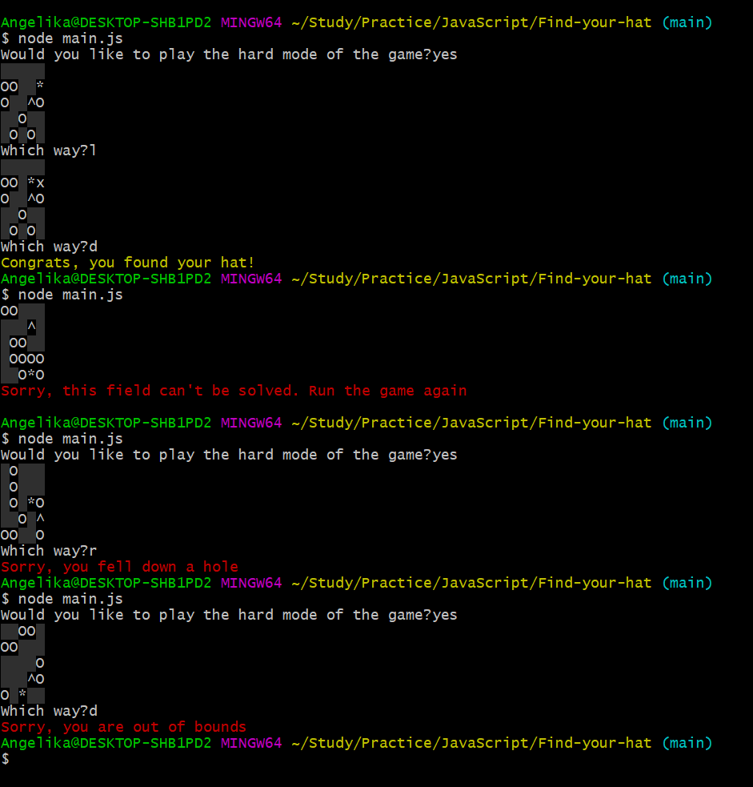

# Find your hat
The interactive terminal game built using JavaScript and Node.js. The scenario is that the player must navigate in the field full of holes to find their hat without falling down one of the holes or stepping outside of the field.
## Usage
To start the game in the project directory run:

### `node main.js`

After running the game you will be asked if you would like to play the hard mode. In the hard mode one more hole will be added after every three turns. You must type `y` or `yes` to play the hard mode. You must type anything else if you don't want to play the hard mode.\
After choosing the mode you will be prompted to type the direction which you would like to move using these symbols:
* `u` - up,
* `d` - down,
* `r` - right,
* `l` - left.

If you found the hat or fell down one of the holes or stepped outside of the field you will be notified about that and the game will be closed.

## Features
The field of the game is always generated randomly. In the beginning and after adding every hole in the hard mode the field will be checked if it's actually can be solved. This feature was built using [Hoshen–Kopelman algorithm](https://en.wikipedia.org/wiki/Hoshen%E2%80%93Kopelman_algorithm) for labeling clusters on a grid. You will be notified about that and in this case you have to run the game again.